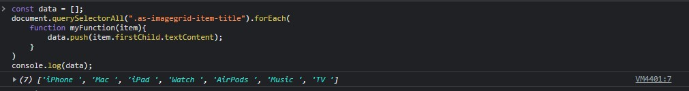

## Assignment-2 Solution



```
const data = [];
document.querySelectorAll(".as-imagegrid-item-title").forEach(
    function myFunction(item){
        data.push(item.firstChild.textContent);
    }
)
console.log(data);

```

---


## 2. Website Name: [Apple](https://support.apple.com/en-in)

### Task


### Fetch all the product name and store in an array

### Output

['iPhone', 'Mac', 'iPad', 'Watch', 'AirPods', 'Music', 'TV']

