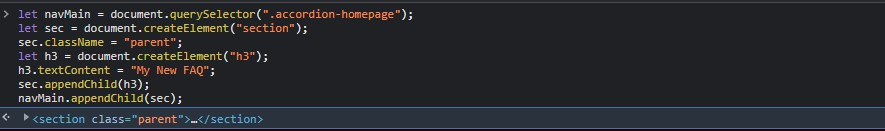
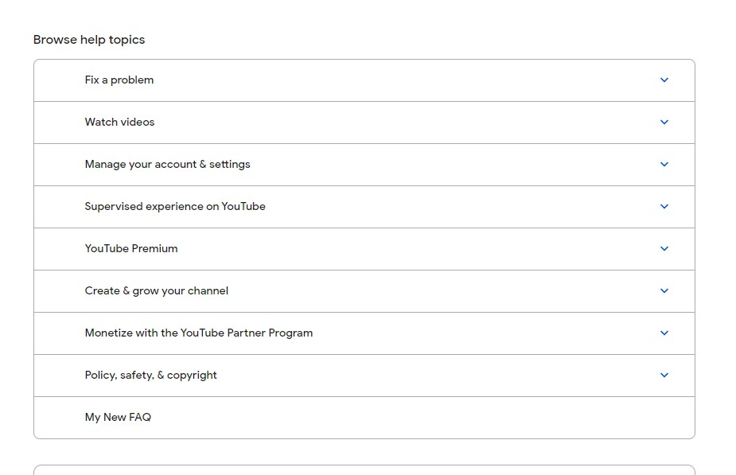

## Assignment-3 Answer

```
let navMain = document.querySelector(".accordion-homepage");
let sec = document.createElement("section");
sec.className = "parent";
let h3 = document.createElement("h3");
h3.textContent = "My New FAQ";
sec.appendChild(h3);
navMain.appendChild(sec);

```



---

## 3. Webiste Name: [Youtube Support](https://support.google.com/youtube/)

### Topics

    - Get Element By Id, Create Element, Create Text Node, Append Child

### Sample Image


### Tasks

     Add another FAQ 'My New FAQ' to the list

### Output


