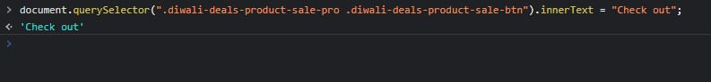

## Assignment-5 Answer

```
document.querySelector(".diwali-deals-product-sale-pro .diwali-deals-product-sale-btn").innerText = "Check out";

```




---

## 5. Webiste Name: [Samsung](https://www.samsung.com/in/offer/online/samsung-fest/)

### Topics

       getElementById, createElement, InnerText, append, setAttribute

### Sample Image


### Tasks

     Target the main div of card and change the Button text to Check out

### Output


