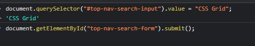
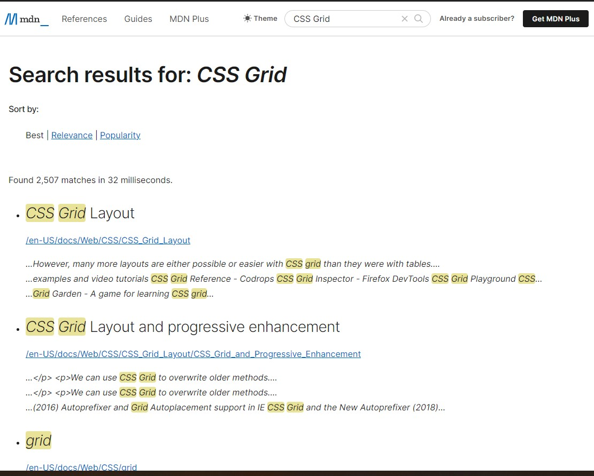
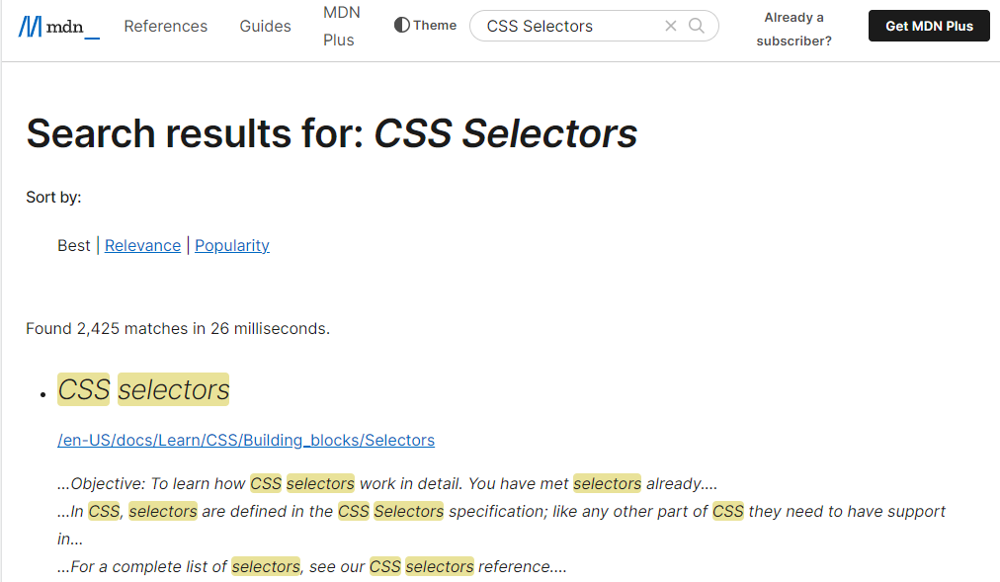

## Assignment-7 Answer

``` 
document.querySelector("#top-nav-search-input").value = "CSS Grid";
document.getElementById("top-nav-search-form").submit();

```





---

## 7. Webiste Name: [MDN Web Docs](https://developer.mozilla.org/en-US/)

### Topics

       Form, Value, Submit

### Sample Image


### Tasks

     To Search a topic in the MDN Search bar.
     First add a text to search in the search bar and then hit the submit search button to search the docs using DOM

### Output

