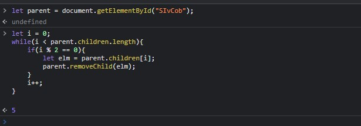
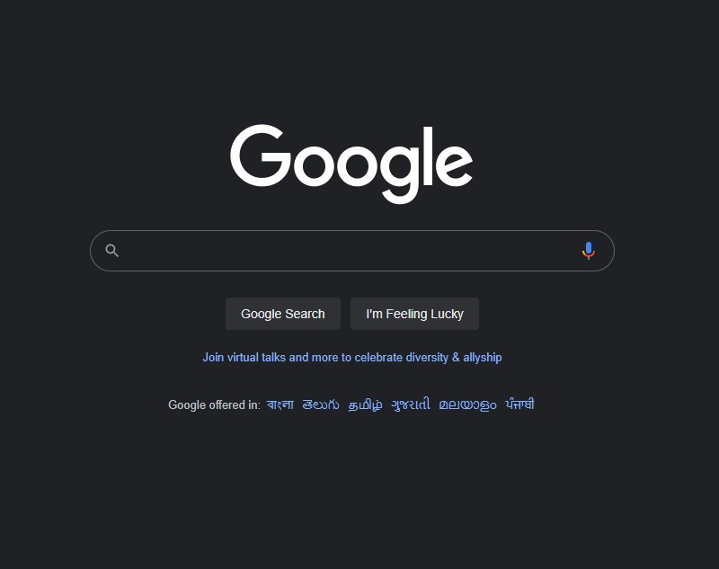

## Assignment-8 Answer

```
let parent = document.getElementById("SIvCob");

let i = 0;
while(i < parent.children.length){
    if(i % 2 == 0){
        let elm = parent.children[i];
        parent.removeChild(elm);
    }
    i++;
}

```






---

## 8. Webiste Name: [Google](https://www.google.com/)

### Topics

       Remove Elements

### Sample Image


### Tasks

     Remove alternate languages from the home page languages listed

### Output

