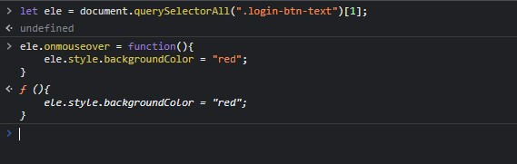
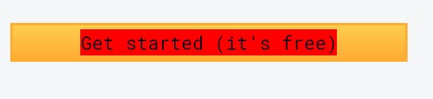

## Assignment 10 

```
let ele = document.querySelectorAll(".login-btn-text")[1];

ele.onmouseover = function(){
    ele.style.backgroundColor = "red";
}

```





---

## 10. Webiste Name: [Freecodecamp](https://www.freecodecamp.org/)

### Topics

       querySelector, mouseover, click eventListener,  callback function, style,

### Sample Image


### Tasks

    Target the button and change background colour on mouseover

### Output


