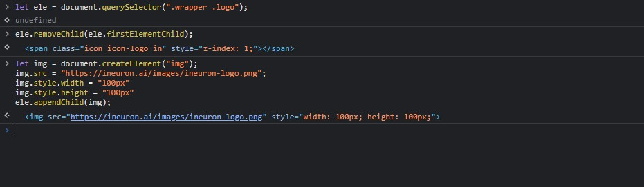
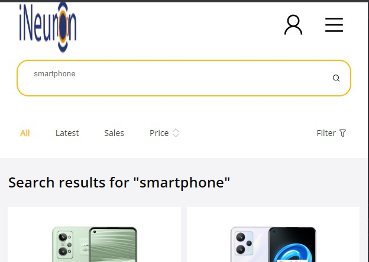

## Assignment 11 Answer

```
let ele = document.querySelector(".wrapper .logo");

ele.removeChild(ele.firstElementChild);

let img = document.createElement("img");
img.src = "https://ineuron.ai/images/ineuron-logo.png";
img.style.width = "100px"
img.style.height = "100px"
ele.appendChild(img);


```






---

## 11. Webiste Name: [realme](https://www.realme.com/in/)

### Topics

       querySelector,style,background-image

### Sample Image


### Tasks

    change the realme logo to ineuron logo

### Output

