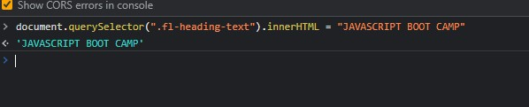
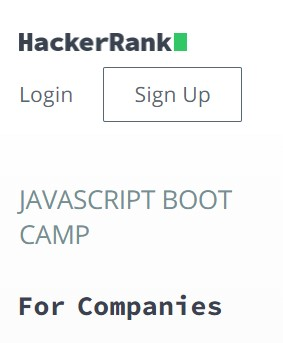

## Assignment 13 Answer

```
document.querySelector(".fl-heading-text").innerHTML = "JAVASCRIPT BOOT CAMP"
```





---

## 13. Webiste Name: [Hackerrank](https://www.hackerrank.com/)

### Topics

       querySelector,innerHtml

### Sample Image


### Tasks

Target the top description and change “Matching developers with great companies” to ‘JSBOOTCAMP“.

### Output

