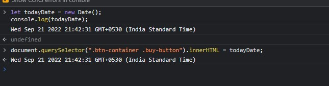

## Assignment 17 answer

```
let todayDate = new Date();

document.querySelector(".btn-container .buy-button").innerHTML = todayDate;

```




---

## 17. Webiste Name: [Sony](https://www.sony.co.in/)

### Topics

    querySelector,innerHTMl

### Sample Image


### Tasks

     change the button text To current Date.

### Output

